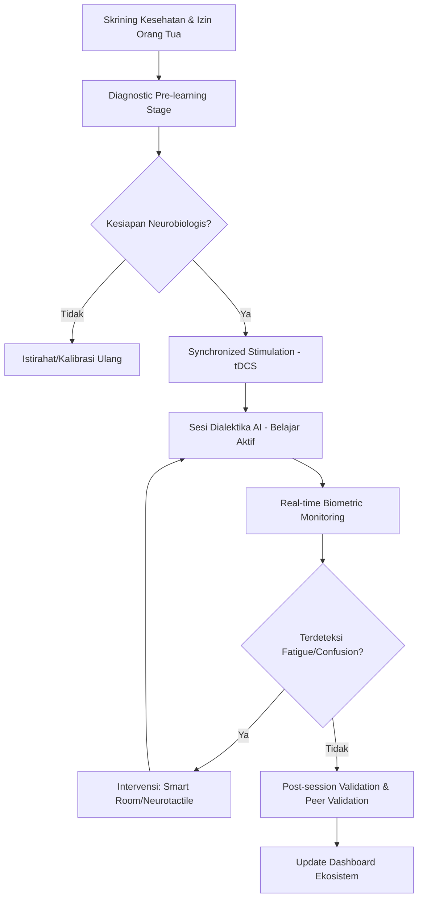
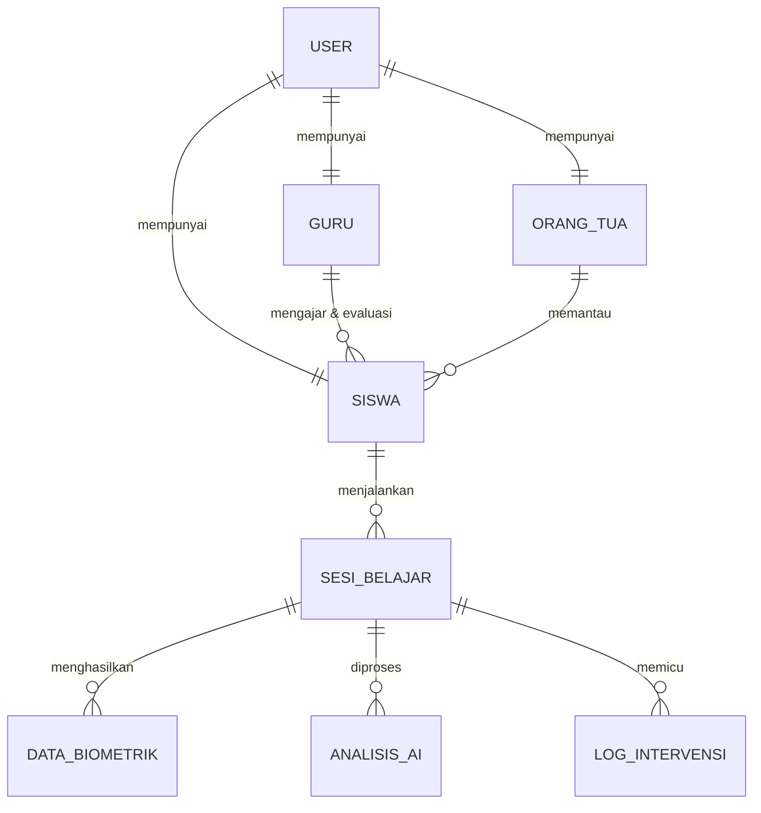
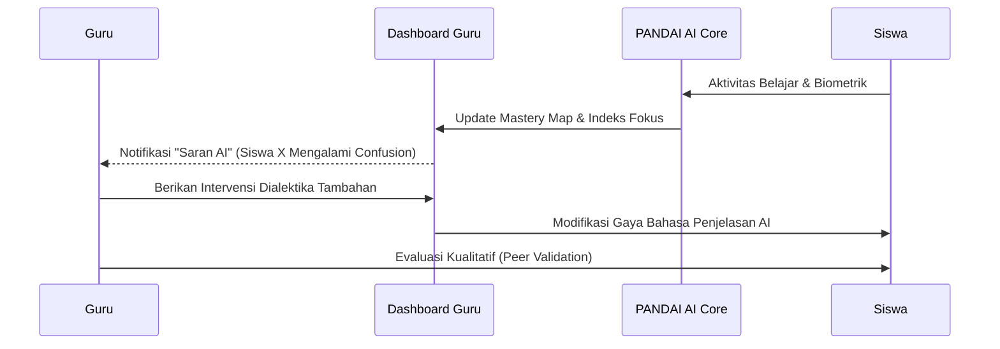
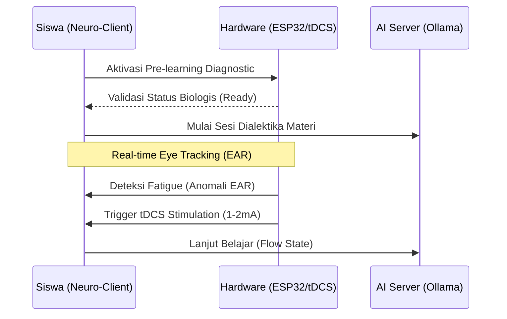

# PANDAI NEUROLEARN 2.0 🧠🚀

**A Symbiotic instructional system designed to accelerate long-term memory retention and neutralize learning loss through Neuro-AI integration.**

---

## 🚨 1. Masalah yang Sedang Dihadapi

Pendidikan di Indonesia saat ini menghadapi krisis sistemik yang mengancam potensi sumber daya manusia di masa depan:

*   **Krisis Literasi & Numerasi**: Rendahnya skor PISA nasional yang diperburuk oleh fenomena *learning loss* pascapandemi COVID-19 (rata-rata kehilangan 11,2 bulan masa belajar).
*   **Learning Gap**: Kesenjangan kompetensi sebesar 5 hingga 6 bulan pada siswa jenjang awal.
*   **Cognitive Overload**: Pembelajaran konvensional pasif seringkali gagal mengakomodasi ambang batas biologis otak; atensi siswa menurun tajam setelah 15-20 menit, memicu kelelahan sinaptik.
*   **Inefisiensi Kurikulum**: Kurikulum saat ini memaksakan durasi panjang tanpa mempertimbangkan *flow state* atau kesiapan neurofisiologis individual.
*   **EdTech Pasif**: Platform teknologi pendidikan saat ini mayoritas hanya fokus pada distribusi konten satu arah tanpa umpan balik biometrik yang objektif.

---

## 💡 2. Solusi yang Dihadirkan

PANDAI NEUROLEARN 2.0 hadir sebagai **Sistem Instruksional Simbiotik** yang radikal untuk melampaui limitasi biologis manusia:

*   **Akselerasi Kurikulum Radikal**: Mengompresi materi pembelajaran yang biasanya membutuhkan 14 hari menjadi hanya **7 hari efektif** melalui optimalisasi *neuroplasticity*.
*   **Neuromodulasi Non-invasif**: Integrasi perangkat **tDCS** (transcranial Direct Current Stimulation) pada area *Dorsolateral Prefrontal Cortex* (DLPFC) untuk memicu eksitabilitas neuronal.
*   **Pemetaan Kognitif Real-time**: Menggunakan *multimodal sensor fusion* (visual, biometrik, perilaku) untuk mendeteksi beban kognitif secara presisi.
*   **Closed-loop Feedback System**: Sinkronisasi instan antara status biologis siswa dengan intervensi AI dan lingkungan fisik (IoT).

---

## ✨ 3. Fitur Utama Project

| Fitur | Deskripsi |
| :--- | :--- |
| **PANDAI AI Core (Ollama)** | Dialektika pembelajaran personal menggunakan Local LLM untuk menjamin privasi data dan ketersediaan luring. |
| **Amigdala Shield** | Protokol keamanan otomatis (*automatic cut-off*) yang memutus arus stimulasi jika terdeteksi anomali biometrik (HR > 130 bpm). |
| **Neurotactile Refocusing** | Pemberian stimulasi taktil mikro sebagai stimulan fisik instan untuk menarik kembali fokus siswa yang terdistraksi. |
| **Smart Room Protocol** | Kontrol lingkungan otomatis berbasis IoT (pencahayaan *cool white* dan frekuensi audio gelombang Beta) untuk menekan melatonin. |
| **Confusion Pinpointing** | Algoritma yang mendeteksi "kebingungan kognitif" melalui korelasi fiksasi mata (EAR) dan lonjakan stres fisiologis (GSR/HRV). |
| **Multi-Stakeholder Dashboard** | Transparansi penuh bagi Guru (saran intervensi), Waka (analitik kurikulum), dan Orang Tua (progres vitalitas). |

---

## 📊 4. Cara Penggunaan (Workflow System)

---

## 🏗️ 5. Arsitektur & Diagram Kerja

### A. Arsitektur Data (ERD Perspective)
Sistem mengelola relasi kompleks antara entitas pengguna, materi, sesi belajar tertutup (*closed-loop*), hingga log intervensi *hardware*.

### B. Diagram Kerja Guru (Monitoring & Intervention)

### C. Diagram Kerja Siswa (Learning Loop)

---

## 🎯 6. Visi & Misi

**Visi**:  
Menjadi motor penggerak transformasi pendidikan nasional yang melampaui limitasi biologis untuk mencetak generasi unggul dengan ketangkasan kognitif tinggi menuju Indonesia Emas 2045.

**Misi**:
1.  **Standardisasi Kognitif**: Menstandarisasi kapasitas kognitif nasional berbasis data neurofisiologis yang objektif.
2.  **Akselerasi Radikal**: Meningkatkan efisiensi waktu penyerapan ilmu pengetahuan secara ekstrem melalui teknologi neuromodulasi.
3.  **Transparansi Ekosistem**: Membangun sinergi dukungan yang jujur dan *real-time* antara Sekolah, Guru, dan Orang Tua.
4.  **Etika & Keamanan**: Menetapkan standar tertinggi dalam keamanan neuroteknologi melalui protokol *Amigdala Shield*.

---

## 📂 7. Struktur Folder

Repositori ini diatur dengan struktur yang modular untuk memudahkan pengembangan dan dokumentasi:

*   **`pandai-dashboard/`**: Dashboard monitoring berbasis web yang ditujukan untuk **Guru, Waka (Wakil Kepala Sekolah), dan Orang Tua**. Dashboard ini berfungsi untuk visualisasi data biometrik, analisis kognitif makro, dan pengelolaan intervensi.
*   **`Siswa/`**: Folder pusat yang berisi seluruh aplikasi yang berinteraksi langsung dengan siswa:
    *   **`Neuro-Client-Siswa/`**: Aplikasi berbasis Desktop (Python/Tkinter) yang berfungsi sebagai pengendali *hardware* biometrik, sensor *eye-tracking*, dan modul stimulasi tDCS dengan latensi minimal.
    *   **`Pandai -LMS-Siswa/`**: *Learning Management System* berbasis Web yang digunakan siswa untuk mengakses materi pembelajaran dan melakukan dialektika dengan AI personal.

---

## 👤 8. Orang di balik project ini

© 2026 PANDAI PROJECT. All Rights Reserved.  
**Lead Developer/Architect**:  
**Thoriq Taqy — Telkom University**

---
*Developed with ❤️ at Telkom University for a Smarter Indonesia.*
